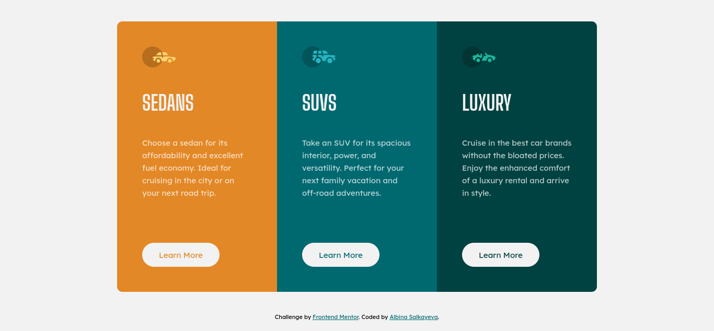

# Frontend Mentor - 3-column preview card component solution

This is a solution to the [3-column preview card component challenge on Frontend Mentor](https://www.frontendmentor.io/challenges/3column-preview-card-component-pH92eAR2-). Frontend Mentor challenges help you improve your coding skills by building realistic projects. 

## Table of contents

- [Overview](#overview)
  - [The challenge](#the-challenge)
  - [Screenshots](#screenshots)
  - [Links](#links)
- [My process](#my-process)
  - [Built with](#built-with)
- [Author](#author)

## Overview

### The challenge

Users should be able to:

- View the optimal layout depending on their device's screen size
- See hover states for interactive elements

### Screenshots

|Desktop|Mobile|
|:-:|:-:|
|||

### Links

- Solution URL: [https://github.com/albina0104/3-column-preview-card-component](https://github.com/albina0104/3-column-preview-card-component)
- Live Site URL: [https://albina0104.github.io/3-column-preview-card-component/](https://albina0104.github.io/3-column-preview-card-component/)

## My process

### Built with

- Semantic HTML5 markup
- CSS custom properties
- Flexbox
- Mobile-first workflow

### Useful resources

- [PX to REM converter](https://nekocalc.com/px-to-rem-converter) - I measured all elements in pixels, and converted to rems, so all the elements will scale and save their proportions in case we choose a bigger font size in the browser.

## Author

- Frontend Mentor - [@albina0104](https://www.frontendmentor.io/profile/albina0104)
- GitHub - [albina0104](https://github.com/albina0104)
